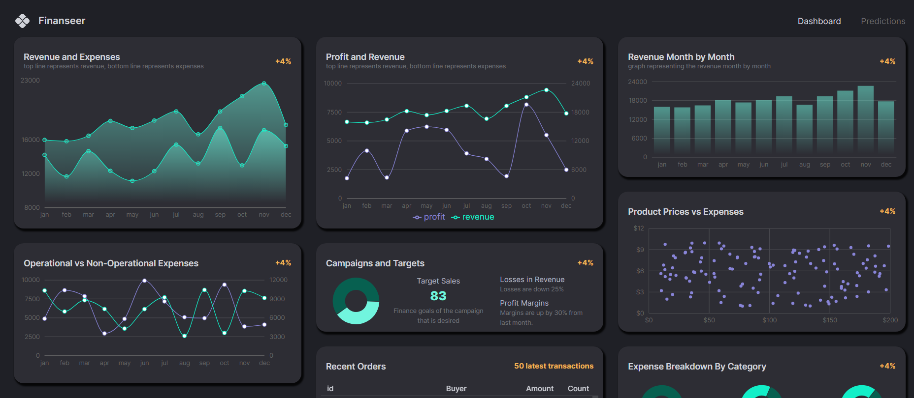

# Finanseer Dashboard App

Building a MERN Finance Dashboard App with Machine Learning, Typescript, React, Node, and MUI.

## Views

  

  

## Setup

- Clone the project: `git@github.com:rOluochKe/finance-dashboard.git`
- Change directory into both client and server directories separately: `cd /client && cd /server`
- Install the required dependencies for both client and server: `npm install`
- Setup mongodb database and add url to `.env` file configuration
- Run both the applications simultaneously: client `npm run dev` and server `npm run dev`
- View the application on the browser using `http://localhost:5173`
