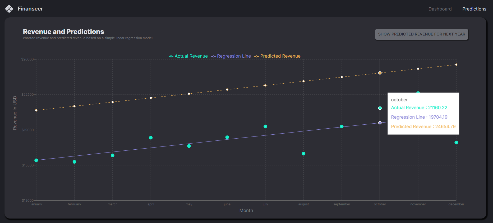

# Finanseer Dashboard App

This finance dashboard application combines the power of Machine Learning, Typescript, React, Node.js, and MUI (Material-UI) to provide users with an intuitive and intelligent platform for financial analysis and decision-making. With its cutting-edge technologies and user-friendly interface, the application offers a comprehensive suite of financial tools.

Machine Learning algorithms are leveraged to provide advanced predictive analytics and data insights, enabling users to make informed financial decisions. Typescript ensures a robust and type-safe codebase, enhancing the application's stability and maintainability.

The React frontend, coupled with MUI, offers a visually appealing and responsive user interface, allowing users to interact with their financial data seamlessly. Node.js powers the backend, facilitating fast and scalable data processing and API integrations.

Through this finance dashboard application, users can track investments, monitor market trends, perform risk assessments, and generate detailed reports. The integration of advanced financial analytics and user-friendly interfaces empowers users to manage their finances effectively and optimize investment strategies.

By harnessing the capabilities of Machine Learning, Typescript, React, Node.js, and MUI, this finance dashboard application revolutionizes financial analysis and empowers users with the tools they need to navigate the complex world of finance.

## Views

  

  

## Setup

- Clone the project: `git@github.com:rOluochKe/finance-dashboard.git`
- Change directory into both client and server directories separately: `cd /client && cd /server`
- Install the required dependencies for both client and server: `npm install`
- Setup mongodb database and add url to `.env` file configuration
- Run both the applications simultaneously: client `npm run dev` and server `npm run dev`
- View the application on the browser using `http://localhost:5173`
